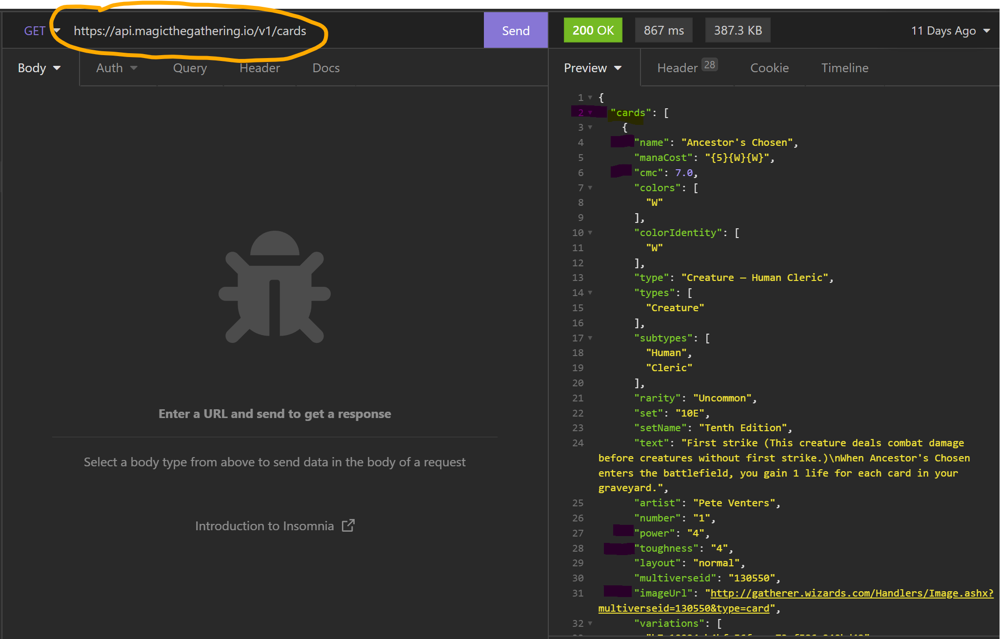

# LABB 2 : URSULA VALLEJO JANNE

## INSOMNIA:

När jag valde API tog jag hänsyn till att den hade en bild, värden som jag senare kunde använda i Chart.JS.

[](insomnia.png)

## HOME >>> AXIOS

Allt innehåll på sidan skickas från JS till home.html.

home.html

```html
<body>
  <div id="hero">
    <!-- form goes here -->
  </div>
</body>
```

### 3 JS files :

1. homeUser.js >>> Skickar info till Home Page och formuläret baserat på om det finns information i local storage:

```javascript
function loadHomeUser() {
  let userName = JSON.parse(localStorage.getItem('userName'))

  if (userName !== null) {
    console.log('User is already stored:', userName)
    divForm.innerHTML = `
  <div id="greeting">
  <div class="containerWelcome">
  <h2 class="txtWelcome"> ${userName} you are already Logged In!</h2>
  <p>To continue with the cards : </p>
  <button class="btnLink"><a href="mainChart.html">CONTINUE</a></button>
  <p id="quoteText"> </p>

  </div>
  </div>
  `
  } else {
    console.log('No user is stored.')
    divForm.innerHTML = `

  <form id="form">
  <fieldset>
  <label for="name" class="textLabel">Please let us know you :</label>
  <input id="name" type="text" placeholder="Write your Name" />
  <label for="consent">

    <input id="consent" type="checkbox" class="inline" />
    <span id="txtCheckbox">I accept the</span> <a href="#">terms and conditions</a>
  </label>
  <div id="errors" class="txtErrors" >
    <ul>
      <li id="name-error">Please provide a name to be able to acces</li>
      <li id="consent-error">Accept the agreement</li>
    </ul>
  </div>
  <input id="send" type="submit" value="Skicka" />
  </fieldset>
  </form>
  <div id="greeting"></div>
  `
  }
  divForm.classList.add('formAcces')
  handleInputs()
}

loadHomeUser()
`
```

2. homeAxios.js >>> Anropa API med Axios / Funktioner häntera 'quoteText' med filter (ta bort undefined):

```javascript
async function loadQuote() {
  let result = await axios.get('https://api.magicthegathering.io/v1/cards')

  quote = dataAxios.filter((dataAxios) => dataAxios.flavor)

  for (let i = quote.length - 1; i > 0; i--) {
    const j = Math.floor(Math.random() * (i + 1))
    ;[quote[i], quote[j]] = [quote[j], quote[i]]
  }
  spanQuote.innerHTML = `" ${quote[0].flavor} " <br> <span>${quote[0].name} </span> `
}
```

3. homeHandler.js >>> Hantera formulärfälten. Tog det från Avancerade uppgifter men detta hanterar även välkomstmeddelandet och den lokala lagringen.

```javascript
function handleInputs() {
  if (userName === '') {
    document.getElementById('name-error').style.display = 'block' // Show name error
  } else {
    document.getElementById('name-error').style.display = 'none' // Hide name error
  }

  if (!isConsented) {
    document.getElementById('consent-error').style.display = 'block' // Show consent error
  } else {
    document.getElementById('consent-error').style.display = 'none' // Hide consent error
  }

  // Enable the button if both fields are true
  sendButton.disabled = !(userName !== '' && isConsented)

  // Hide or show the divElement
  if (userName === '' || !isConsented) {
    divElement.style.display = 'block' // Show div
  } else {
    divElement.style.display = 'none' // Hide div
  }
}

nameInput.addEventListener('input', handleInputs)
consentCheckbox.addEventListener('input', handleInputs)

formElement.addEventListener('submit', function (event) {
  event.preventDefault()

  document.getElementById('form').style.display = 'none' // Hide
  let userName = nameInput.value
  divGreeting.innerHTML = `
  <div class="containerWelcome">
  <h2 class="txtWelcome">Hi ${userName}!</h2>
  <p>We are really happy you visit our page. To be able to continue press the button!!</p>
  <button class="btnLink"><a href="mainChart.html">NEXT</a></button>
  </div>`
  localStorage.setItem('userName', JSON.stringify(userName))
})
```

---

## MAIN >>> FETCH:

HTML-fälten kommer att hantera sök alternativet för korten, det 'ramdom' urvalet som laddas med sidan, en valknapp som kan laddas nya kort.

mainChart.html

```html
<!-- Search area-->
<section class="searchRefresh">
  <div class="search-fields">
    <input
      id="searchInput"
      class="search-fields-input"
      placeholder="Search cards"
    />
    <input />
  </div>
</section>

<!-- Search results-->
<section>
  <h1 class="textSearch">Your search: -max 3 cards-</h1>
  <!-- LoadAwesome -->
  <div id="loading" style="display: none; color: #9787ea" class="la-fire la-3x">
    <div></div>
    <div></div>
    <div></div>
  </div>

  <div id="searchResults">
    <!-- Max 3 cards result search -->
  </div>
</section>

<!-- Random Selection Cards-->
<main class="setCards">
  <h1>The Cards we have selected for you:</h1>
  <div class="centerElement">
    <input
      id="refresh"
      class="btn btn-primary"
      type="button"
      value="New Cards"
    />
  </div>
  <ul id="allCards" class="carousel-inner">
    <!-- Selection cards go here -->
    <
  </ul>
</main>
```

### 4 JS files : Men ska visa en som är relaterad med G uppgifter.

1. mainChart.js >>>

Här använder jag FETCH. Använd det vi såg med Vanja som bas för att dölja fält och laddaren. I den här delen använder jag en Random så att varje gång användaren går in kan de se olika kort. Till detta gjorde jag även en knapp. Använd ett filter för att bara ha matrisinformationen som följer med bilderna och begränsa visningen till 12 bilder. En 'onload' så att informationen endast visas när bilderna är laddade.

```javascript
//Hide Chart / search text on load
myChartCanvas.style.display = 'block' // set to none if not are using Boostrap
searchText.style.display = 'none'

let chart = null

//Track Chart visibility
let chartVisible = false

//Remove data from search input when refresh page
document.querySelector('#searchInput').value = ''

//To fetch the data. For DRY we isolated it to be re-used:

let magicData = []

function fetchAndDisplayCards() {
  fetch('https://api.magicthegathering.io/v1/cards')
    .then((response) => response.json())
    .then((data) => {
      magicData = data
      displayRandomCards(data.cards)
      console.log(data.cards)
    })
}

// Fisher-Yates shuffle algorithm to randomize the array of cards
function shuffleArray(array) {
  for (let i = array.length - 1; i > 0; i--) {
    const j = Math.floor(Math.random() * (i + 1))
    ;[array[i], array[j]] = [array[j], array[i]]
  }
}

function displayRandomCards(cards) {
  shuffleArray(cards)

  // Clear the previous list
  ul.innerHTML = ''

  // to send if to Chart.Js
  const labels = []
  const dataPower = []
  const dataToughness = []
  const dataCmc = []

  // Filter the cards that have a image first

  cards = cards.filter((card) => card.imageUrl)

  for (let n = 0; n < Math.min(12, cards.length); n++) {
    if (cards[n].imageUrl) {
      const li = document.createElement('li')
      const img = document.createElement('img')
      const pName = document.createElement('p')
      const span = document.createElement('span')
      const p = document.createElement('p')
      const p2 = document.createElement('p')
      const p3 = document.createElement('p')
      img.setAttribute('alt', 'cardImage')
      img.setAttribute('src', cards[n].imageUrl)

      // Classes to style
      li.classList.add('image-item') // slider 1
      // li.classList.add('carousel-item') // boostrap
      // img.classList.add('d-block') // boostrap
      // img.classList.add('w-100') // boostrap
      pName.classList.add('centered-card-list-item')
      p3.classList.add('powerCard')
      pName.classList.add('titleCard')
      p.classList.add('txtArtist')

      //To show the text after the image is loaded:

      img.onload = () => {
        pName.textContent = ` ${cards[n].name.toUpperCase()}`
        p.textContent = `Artist: ${cards[n].artist}`
        p2.innerHTML = `Type: ${cards[n].type} `
        span.innerHTML = `<br>Mana Cost: ${cards[n].cmc} `
        // Some cards dont have power/Toughness for not be showed when undefined:
        p3.textContent =
          cards[n].power !== undefined && cards[n].toughness !== undefined
            ? `Power: ${cards[n].power} Toughness: ${cards[n].toughness} `
            : ''
      }
    }
  }
}
```

Här använde jag även ett filter för att bara visa information med bilder och begränsade det till att visa 3 kort. Hantera meddelanden i sökfältet med ett 'if/else'. Och setTimeout för att vissas loader.

```javascript
function displaySearchResults(filteredCards) {
  // Clear the previous search results
  searchResultsDiv.innerHTML = ''

  //Hide searchText
  searchText.style.display = 'none'

  // Filter out cards without images
  filteredCards = filteredCards.filter((card) => card.imageUrl)
  setTimeout(() => {
    if (filteredCards.length === 0) {
      searchResultsDiv.innerHTML =
        '<p class="searchMessage">No results found...Try again!</p>'
    } else {
      // Display a maximum of 3 results
      searchText.style.display = 'block'

      const maxResults = Math.min(3, filteredCards.length)

      for (let i = 0; i < maxResults; i++) {
        const card = filteredCards[i]
        pType.textContent = `Card Type: ${card.type} `
        pMana.textContent = `Mana Cost: ${card.cmc} `
      }
    }

    // Hide loader animation
    document.querySelector('#loading').style.display = 'none'
  }, 1100)
}

function searchCards(cards, query) {
  const filteredCards = cards.filter((card) => {
    return card.name.toLowerCase().includes(query.toLowerCase())
  })
  displaySearchResults(filteredCards)
}

// Button To refresh the Cards
document.getElementById('refresh').addEventListener('click', () => {
  document.querySelector('.textSearch').style.display = 'none'
  fetchAndDisplayCards()
  // Clear the search input
  searchInput.value = ''
  // Clear the search results
  searchResultsDiv.innerHTML = ''
})

// Button To search the cards
searchButton.addEventListener('click', () => {
  const query = searchInput.value

  //show loader animation
  document.querySelector('#loading').style.display = 'block'

  if (query) {
    searchCards(magicData.cards, query)
  } else {
    // Clear the search results
    searchResultsDiv.innerHTML = ''
    // Hide loader animation
    document.querySelector('#loading').style.display = 'none'
    // Show a message if no query is provided
    searchResultsDiv.innerHTML =
      '<p class="searchMessage">Please enter a search query and try again!</p>'
  }
})
```
