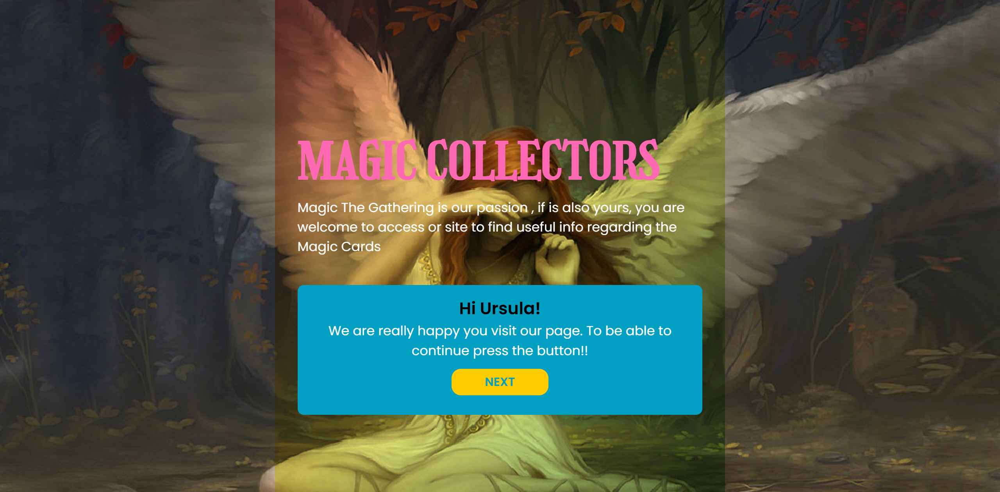

### November 2023

**Project Summary**

A Magic: The Gathering–inspired web application built entirely with HTML, CSS, and vanilla JavaScript. Upon loading, users see a login form on `home.html`—their name is validated and stored in `localStorage`, and a random flavor quote is fetched via Axios. Once logged in, they navigate to `mainChart.html`, where the app:

- Fetches a full set of card data from the public MTG API using the Fetch API.
- Randomly selects up to 12 cards and displays them as a responsive carousel powered by SwiperJS, and includes a “New Cards” button to reshuffle and load another random selection.
- Builds a Chart.js visualization that compares selected cards’ power, toughness, and converted mana cost, dynamically updating once the 12 images are loaded.
- Provides a search bar that filters card names (displaying up to three results) with a loader animation from Load Awesome.
- Uses CSS Grid and Flexbox for a clean, mobile-first layout and Bootstrap utility classes for basic styling.
- Implements a color palette defined in CSS custom properties (green, dark grays, cyan, orange, pink, etc.) with WCAG-compliant contrast ratios.

Overall, the project demonstrates native JS techniques for form handling, API consumption, randomization (Fisher–Yates shuffle), conditional rendering (hiding/showing loaders and messages), and DOM updates—meeting course requirements for a fully functional, client-side application without any frameworks.

Additionally, the project includes an extra “Cities” CRUD page—unrelated to cards—where users can create, read, update, and delete city records via Fetch to a mock endpoint. This satisfies a separate requirement for practicing RESTful operations.

#### [Demo Project-ITHögskola ](https://magic-collectors.netlify.app/home.html)

---

### 🛠️ Technologies Used

- **HTML5** for semantic document structure and markup
- **CSS3** (Flexbox & Grid) for responsive layout, styling, and animations
- **Vanilla JavaScript** for DOM manipulation, event handling, and application logic
- **Axios** for AJAX calls on the home page (fetching quotes/cards)
- **Fetch API** for loading card data on the main page
- **Chart.js** for potential data visualization (cards’ stats)
- **SwiperJS** for carousel/slider functionality (displaying card images)
- **Load Awesome (Animated Icons)** for loading indicator animations
- **Bootstrap** (via CDN) for quick utility classes and button styling
- **Remixicon** (via CDN) for vector icons in the UI
- **Insomnia** (or any REST client) to test the external Magic: The Gathering API endpoints during development

---

### General view:





CRUD: Cities Api


---

### 🚀 How to Run the Project Locally

1. **Clone or download** the project folder

   ```bash
   git clone <your-repo-url>
   cd <project-folder>
   ```

2. **Install dependencies** (if using local package files like Chart.js or Swiper via NPM; otherwise skip)

   ```bash
   npm install
   ```

3. **Open `home.html` in a browser**

   - Use VS Code Live Server or any HTTP server to serve the root directory (so that files like CSS, JS, and assets load correctly).
   - For example, if you have Live Server installed, right-click on `home.html` and choose “Open with Live Server.”
   - The page should then be available at `http://localhost:5500/home.html` (or whatever port your server assigns).

4. **Navigate through the app**

   - On the home page, fill in the form and accept terms to proceed to the main card interface.
   - The “Main” page (`mainChart.html`) will automatically fetch and display randomized card data, provide a search bar, loading animation, and allow manual refresh of card selections.

---

### 📄 [Detailed Information of the Project](PRESENTATIONSV.md)

- Below pages that I used as reference for the project :

[Animated Icons: Load Awesome ](https://labs.danielcardoso.net/load-awesome/animations/fire.html)

[Chart: Chart.JS ](https://www.chartjs.org/docs/latest/)

[Carrousel: SwiperJS ](https://swiperjs.com/)

[NavBar: CodePen ](https://codepen.io/sabinebogers/pen/ZBprgq)

[Remixion ](https://cdnjs.com/libraries/remixicon)

[Boostrap](https://getbootstrap.com/)

# Layout Project - wireframes :

[>](wireFrame.jpg)

# Color Palette :

See bellow the palette I took in consideration :

[](documentation/colorpaletteLABB2.jpg)

The colors decide to implemented:

```css
:root {
  --background: #85e2b3;
  --background-color-dark: #404040;
  --primary-color: #019fc2;
  --contrast-color: #ff6600;
  --color-contrast-yellow: #ffcc00;
  --primary-text: #000000;
  --text-white: #ffffff;
  --secondary-text: #575656ff;
  --text-rosa: #ff69b4;
  --form-color: #f08080;
}
```
